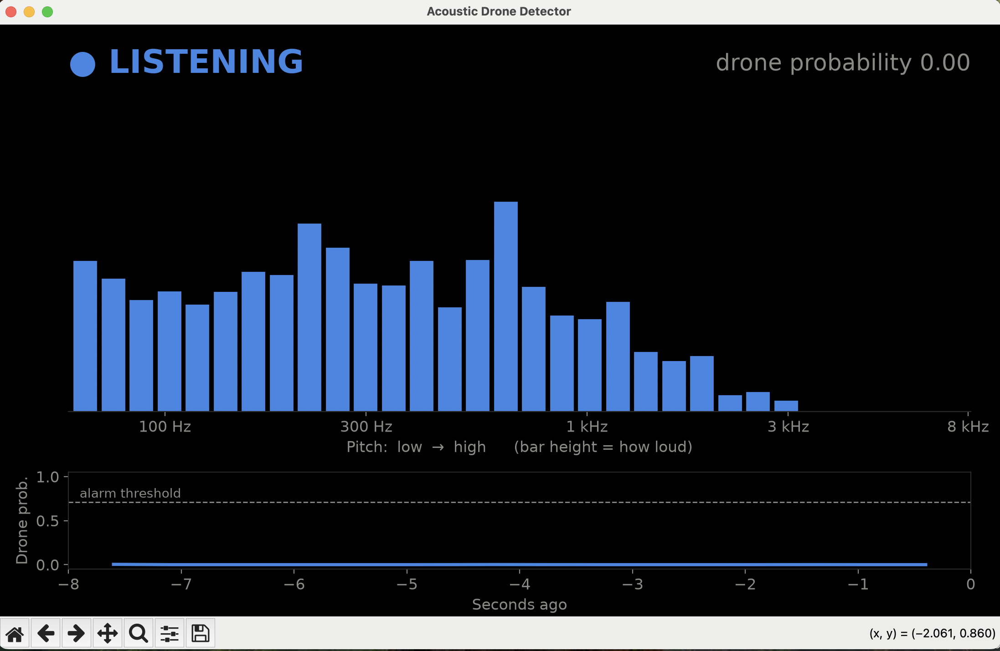
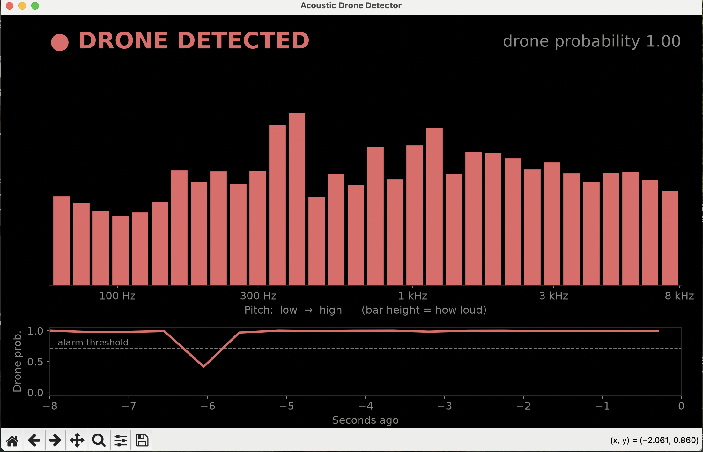

# Acoustic Drone Detector

Detects drones by sound. A microphone listens, a small model decides "drone" or "not drone" every half second, and the result can drive a local alarm, with no internet connection needed. The long-term aim is a cheap, offline early-warning sensor that gives people time to take cover.

<p>
  
  
</p>

*Live demo (`src/viz.py`). Left: normal room sound, energy mostly below 3 kHz, probability 0. Right: a drone playing from a phone, energy across the whole range with strong propeller peaks; the alarm stays on even when one window dips to 0.4, because it needs 3 of the last 5 windows to agree.*

## Why

Small drones have become cheap, common weapons in modern conflicts, and they are hard to see coming, especially at night or under tree cover. Radar and camera-based counter-drone systems are expensive and usually need power and network infrastructure that many communities don't have. But drones are loud: their propellers make a steady, recognizable buzz. Ukraine's Sky Fortress network has shown that inexpensive microphones can detect drones at scale.

This project explores the low-cost end of that idea: **one microphone and a small model, running fully offline, that can sound a local alarm and give people time to take cover.** No internet, no cloud, cheap enough to place in many locations.

**Current state:** a model that classifies 0.96 s audio windows as drone / not drone, running live on a laptop microphone, with an augmentation experiment for quieter, farther drones. Next: testing across drone types (including military-style fixed-wing drones) and moving onto a Raspberry Pi.

## How it works

```
audio  ──→  16 kHz mono, 0.96 s windows  ──→  YAMNet (pretrained, frozen)  ──→  1024-number embedding  ──→  classifier  ──→  drone / not drone
           src/audio.py                      src/yamnet.py                                                  src/train.py
```

1. **Standardize the audio** (`audio.py`): convert any clip to 16 kHz mono and cut it into 0.96 s windows that overlap by half.
2. **Embed** (`yamnet.py`): Google's [YAMNet](https://tfhub.dev/google/yamnet/1), trained on ~2M YouTube clips across 521 sound classes, turns each window into 1024 numbers describing the sound. We use it as a frozen feature extractor.
3. **Classify** (`train.py`): a logistic regression on those embeddings decides drone vs. not drone.

The same `audio.py` and `yamnet.py` are meant to run on the device, so training and live use process sound identically.

## Results

Logistic regression on YAMNet embeddings, one prediction per 0.96 s window. Regularization and the alarm threshold (0.71) were chosen on validation only; test was scored once.

| Split | Precision | Recall | F1 | False-alarm rate |
|---|---|---|---|---|
| Validation | 99.4% | 99.6% | 99.5% | 0.6% |
| **Test** | **98.5%** | **78.7%** | **87.5%** | **1.0%** |
| Test without the two long-recording groups | 98.4% | 99.4% | – | – |

<p>
  
  
</p>

**What the gap means.** Almost all missed windows come from two recording groups (`drone:6`, `drone:7`), which hold *every* long drone recording in the dataset (258 clips, up to 5 min). They're much quieter than the rest (median RMS 0.03–0.04 vs ~0.2), likely real flights recorded at a distance, and the split put them all in test, so the model never trained on anything like them.


Typical drone clips score near 1 and non-drone windows near 0, but **63% of the quiet drone windows also score near 0**. Moving the threshold wouldn't fix that; the model doesn't recognize them. This is the domain-shift problem described in *Acoustic UAV Detection in Battlefield Scenarios* (arXiv 2608.14287), showing up in public data.

### Per recording: does the alarm go off?

Window scores undersell an alarm system: what matters is whether the alarm (3 of the last 5 windows above threshold) fires *at some point* while a drone is there, and how often it fires when none is.

| Test, per recording | Original model | + far-away augmentation |
|---|---|---|
| Drone recordings that raised the alarm | **98.3%** | 97.9% |
| Quiet, long drone recordings that raised the alarm | 33.7% | **53.1%** |
| Non-drone recordings with a false alarm | **1.5%** | 3.4% |

**Augmentation** (`augment.py`): every training drone clip gets a copy that sounds farther away: muffled (low-pass 0.8–4 kHz), mixed with real background noise (SNR −5 to 20 dB) and turned down (−35 to −5 dB); some non-drone clips get random volume too, so loudness alone can't separate the classes. It lifts the quiet recordings from about 1 in 3 to more than 1 in 2, but doubles false alarms, so it's a trade-off, not a free win. The live demo keeps the original model for now. *(Caveat: these quiet recordings were already used to diagnose the problem, so this is a check that the fix works, not a fully blind test.)*

**Weak labels.** Inside a single quiet recording, loudness swings ~50× (RMS 0.01 to 0.58) as the drone moves, and YAMNet's own top label for some 20 s clips is "Silence" or "Mains hum". The whole recording is labeled "drone", but the drone isn't audible in every window, so part of the "miss" rate is windows with nothing to hear.

## Limitations and next steps

- **Drone types.** The data is mostly small consumer quadcopters, close up. Larger multirotors and fixed-wing, engine-powered drones (e.g. Shahed-type) sound very different. Next: a test set across drone types, with results per type.
- **Shortcut risk.** Drone and non-drone clips come from different source datasets, so part of what the model learns may be "which dataset". Real recordings through the device's own microphone are the real check.
- **Weak labels.** Window labels are inherited from the whole recording; finding the windows where the drone is actually audible would give cleaner training and fairer scores.
- **False alarms vs. range.** Catching quieter drones currently costs more false alarms; loudness normalization (e.g. PCEN) and a better background-noise set are the next things to try.

## Design decisions

- **Leak-free split.** The dataset renamed files to sequential numbers, so clips cut from one recording sit next to each other. `prepare.py` splits whole **blocks of 200 consecutive clips** (per class) into train/val/test 70/15/15, so one recording can't be in both train and test.
- **Cleaning with reasons.** Unreadable, too-short (< 0.5 s), silent "drone" and duplicate clips are dropped (203 of 180,320), each with its reason recorded in the manifest.
- **Loop, don't pad.** Drone clips are mostly 0.5 s while non-drone clips average ~7 s. Padding short clips with silence would let the model learn "half-silent window = drone", which never happens with a live mic, so short clips are looped to fill a window.
- **One window per YAMNet call.** Batching windows into one call is ~6x faster but changes the embeddings slightly (cosine similarity 0.93–0.99), so training would no longer match the live device.
- **Capped windows per clip** (30), so a few long recordings can't dominate training.

## Data

[drone-audio-detection-samples](https://huggingface.co/datasets/geronimobasso/drone-audio-detection-samples): ~180k clips, ~61 h (27 h drone, 34 h not drone), 16 kHz mono. It combines Al-Emadi's DroneAudioDataset, DREGON, SPCup19 and others (drone) with UrbanSound8K, TUT 2017, ESC-50 and others (not drone). After windowing: 277k train, 48k validation and 71k test windows, roughly balanced between classes. Check each source's license before commercial use.

## Run it

```bash
~/.pyenv/versions/3.12.0/bin/python -m venv .venv
.venv/bin/pip install huggingface_hub pyarrow pandas numpy soundfile scipy scikit-learn \
    tensorflow tensorflow-hub matplotlib sounddevice "setuptools<81"   # tensorflow-hub still imports pkg_resources
cd src
../.venv/bin/python prepare.py   # clean + split → data/processed/manifest.parquet (minutes)
../.venv/bin/python embed.py     # YAMNet embeddings → data/processed/*.npz (~40 min on a laptop CPU, resumable)
../.venv/bin/python augment.py   # optional: far-away drone copies → train_aug.npz (~20 min)
../.venv/bin/python train.py     # classifier + metrics → models/ (minutes); add --aug to include augment.py data
../.venv/bin/python evaluate.py  # plots → docs/
```

### Live detection

```bash
cd src
../.venv/bin/python live.py            # listen on the microphone (Ctrl+C to stop)
../.venv/bin/python live.py clip.wav   # or run on a recording
```

For a visual version, run `../.venv/bin/python viz.py` (or `viz.py clip.wav`): equalizer-style pitch bars (low to high, height = loudness) with the drone probability over the last 8 seconds underneath, all turning red when a drone is detected.

Every 0.48 s it scores the latest 0.96 s of sound and prints the drone probability. It only says **DRONE** when at least 3 of the last 5 windows are above the threshold, so a single odd sound doesn't trigger it (about a 1 s delay before the alarm turns on).

Download the dataset first into `data/raw/` with `huggingface_hub.snapshot_download("geronimobasso/drone-audio-detection-samples", repo_type="dataset", local_dir="data/raw")`.
