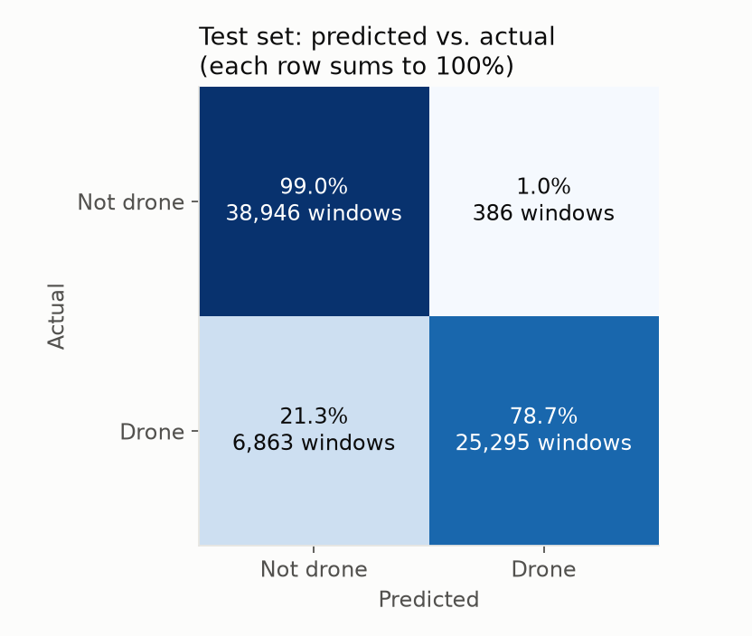
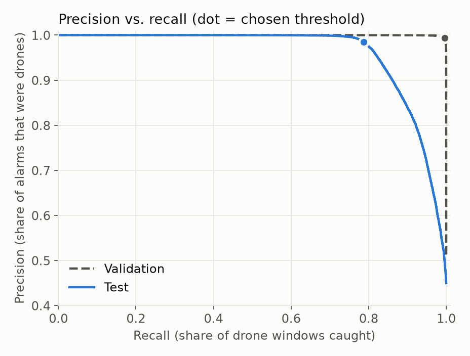
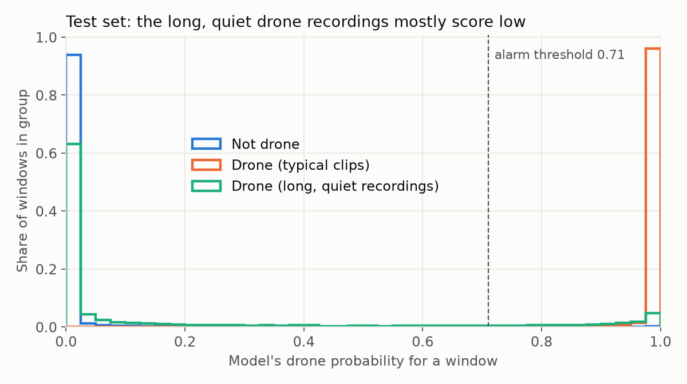

# Acoustic Drone Detector

Detects drones by sound. A microphone listens, a small model decides "drone" or "not drone" every half second, and the result can drive a local alarm, with no internet connection needed. The long-term aim is a cheap, offline early-warning sensor that gives people time to take cover.

**Current goal:** train a model that classifies 0.96 s audio windows as drone / not drone, then run it live on a laptop microphone. *(Training is done, results below; the live demo is next.)*

## How it works

```
audio  ──→  16 kHz mono, 0.96 s windows  ──→  YAMNet (pretrained, frozen)  ──→  1024-number embedding  ──→  classifier  ──→  drone / not drone
           src/audio.py                      src/yamnet.py                                                  src/train.py
```

1. **Standardize the audio** (`audio.py`): convert any clip to 16 kHz mono and cut it into 0.96 s windows that overlap by half.
2. **Embed** (`yamnet.py`): Google's [YAMNet](https://tfhub.dev/google/yamnet/1), trained on ~2M YouTube clips across 521 sound classes, turns each window into 1024 numbers describing the sound. We use it as a frozen feature extractor.
3. **Classify** (`train.py`): a logistic regression on those embeddings decides drone vs. not drone.

The same `audio.py` and `yamnet.py` are meant to run on the device, so training and live use process sound identically.

## Results

Logistic regression on YAMNet embeddings, one prediction per 0.96 s window. Regularization and the alarm threshold (0.71) were chosen on validation only; test was scored once.

| Split | Precision | Recall | F1 | False-alarm rate |
|---|---|---|---|---|
| Validation | 99.4% | 99.6% | 99.5% | 0.6% |
| **Test** | **98.5%** | **78.7%** | **87.5%** | **1.0%** |
| Test without the two long-recording groups | 98.4% | 99.4% | – | – |

<p>
  
  
</p>

**What the gap means.** Almost all missed drones come from two recording groups (`drone:6`, `drone:7`). They hold *every* long drone recording in the dataset (258 clips, up to 5 min) and are much quieter than the rest (median RMS 0.03–0.04 vs ~0.2), likely a different source, such as real flights recorded at a distance. The split put both groups in test, so the model never trained on anything like them and misses 87% of their windows.



The plot above shows it directly: typical drone clips score near 1 and non-drone windows near 0, but **63% of the long, quiet drone windows score near 0, as if they weren't drones at all**. That's not a threshold problem (moving the line wouldn't fix it); the model doesn't recognize them.

The model has learned "loud, close-range drone clips" very well, but doesn't yet generalize to quieter, real-flight-like recordings, which is exactly what a deployed sensor faces. This is the domain-shift problem described in *Acoustic UAV Detection in Battlefield Scenarios* (arXiv 2608.14287), showing up in public data.

**Next steps**
- Volume augmentation and mixing drone clips with background noise, so loudness stops being a shortcut
- Source-aware evaluation: hold out whole recording sources and report per-source results
- Loudness normalization (e.g. PCEN) before the classifier
- Testing on real recordings through the device's own microphone

## Design decisions

- **Leak-free split.** The dataset renamed files to sequential numbers, so clips cut from one recording sit next to each other. `prepare.py` splits whole **blocks of 200 consecutive clips** (per class) into train/val/test 70/15/15, so one recording can't be in both train and test.
- **Cleaning with reasons.** Unreadable, too-short (< 0.5 s), silent "drone" and duplicate clips are dropped (203 of 180,320), each with its reason recorded in the manifest.
- **Loop, don't pad.** Drone clips are mostly 0.5 s while non-drone clips average ~7 s. Padding short clips with silence would let the model learn "half-silent window = drone", which never happens with a live mic, so short clips are looped to fill a window.
- **One window per YAMNet call.** Batching windows into one call is ~6x faster but changes the embeddings slightly (cosine similarity 0.93–0.99), so training would no longer match the live device.
- **Capped windows per clip** (30), so a few long recordings can't dominate training.

## Limitations

- **Shortcut risk.** Drone and non-drone clips come from different source datasets, so part of what the model learns may be "which dataset" rather than "is there a drone".
- **Clean data.** Public drone recordings are mostly close-range; real conditions (distance, wind, engines, rain) are harder.
- **Window-level metrics.** A deployed alarm would smooth predictions over several windows; that isn't evaluated yet.

## Data

[drone-audio-detection-samples](https://huggingface.co/datasets/geronimobasso/drone-audio-detection-samples): ~180k clips, ~61 h (27 h drone, 34 h not drone), 16 kHz mono. It combines Al-Emadi's DroneAudioDataset, DREGON, SPCup19 and others (drone) with UrbanSound8K, TUT 2017, ESC-50 and others (not drone). After windowing: 277k train, 48k validation and 71k test windows, roughly balanced between classes. Check each source's license before commercial use.

## Run it

```bash
~/.pyenv/versions/3.12.0/bin/python -m venv .venv
.venv/bin/pip install huggingface_hub pyarrow pandas numpy soundfile scipy scikit-learn \
    tensorflow tensorflow-hub matplotlib sounddevice "setuptools<81"   # tensorflow-hub still imports pkg_resources
cd src
../.venv/bin/python prepare.py   # clean + split → data/processed/manifest.parquet (minutes)
../.venv/bin/python embed.py     # YAMNet embeddings → data/processed/*.npz (~40 min on a laptop CPU, resumable)
../.venv/bin/python train.py     # classifier + metrics → models/ (minutes)
../.venv/bin/python evaluate.py  # plots → docs/
```

### Live detection

```bash
cd src
../.venv/bin/python live.py            # listen on the microphone (Ctrl+C to stop)
../.venv/bin/python live.py clip.wav   # or run on a recording
```

For a visual version, run `../.venv/bin/python viz.py` (or `viz.py clip.wav`): equalizer-style pitch bars (low to high, height = loudness) with the drone probability over the last 8 seconds underneath, all turning red when a drone is detected.

Every 0.48 s it scores the latest 0.96 s of sound and prints the drone probability. It only says **DRONE** when at least 3 of the last 5 windows are above the threshold, so a single odd sound doesn't trigger it (about a 1 s delay before the alarm turns on).

Download the dataset first into `data/raw/` with `huggingface_hub.snapshot_download("geronimobasso/drone-audio-detection-samples", repo_type="dataset", local_dir="data/raw")`.
